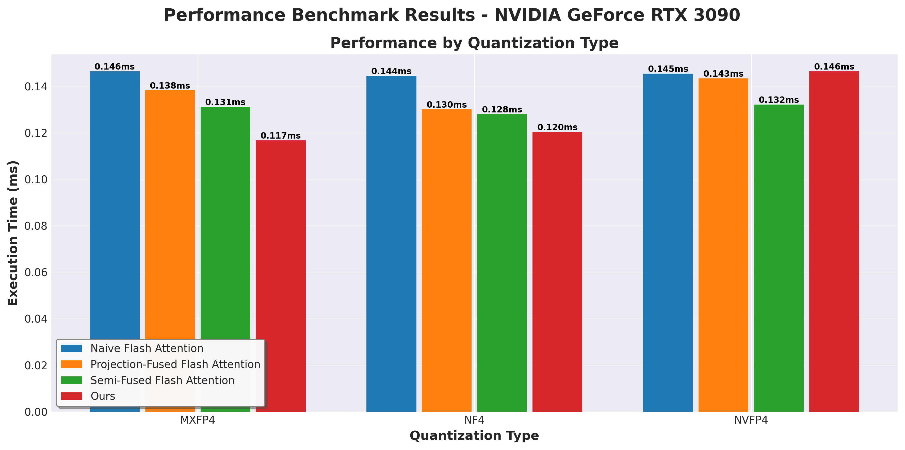
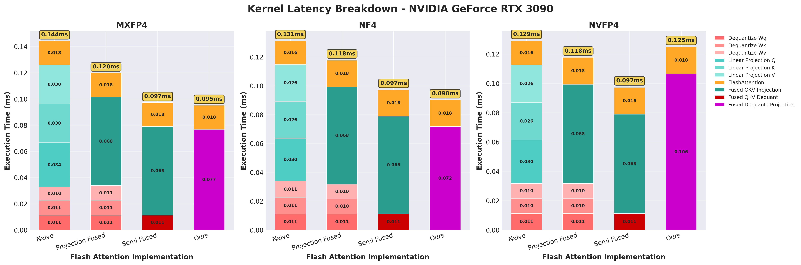

# 🔥 Fusing Block-wise Dequantization into QKV Projection for Block-wise Quantized LLM Attention

This repository implements and evaluates CUDA kernels for the **attention layer of quantized Large Language Models (LLMs)**, with a focus on **block-wise 4-bit weight quantization** such as **MXFP4, NF4, and NVFP4**.

The core idea is a **two-stage pipeline**:

1. A **fused block-wise dequantization + Q/K/V projection kernel**.
2. An **off-the-shelf FlashAttention-style kernel** for the attention computation.

By fusing dequantization directly into the QKV projection, while leaving the FlashAttention backend unchanged, we **significantly reduce memory traffic and kernel launches**, improving end-to-end attention latency on GPUs.

> This project was implemented and evaluated with **CUDA 12.4** on **NVIDIA RTX 3090**.

## 🤝 Contributors

* [Jaemin Kim](mailto:jm611@unist.ac.kr) · [@ginjae](https://github.com/ginjae)
* [Jiseung Jeong](mailto:wjdwltmd1151@unist.ac.kr) · [@jiseungjeong](https://github.com/jiseungjeong)

Department of Computer Science & Engineering, UNIST


## 🚀 Quick Start

### 📦 Extract Real GPT-2 Weights (Recommended)

For realistic evaluation, we use actual GPT-2 attention weights as the baseline:

```bash
# Install required dependencies
pip install torch transformers numpy

# Extract weights from GPT-2 (layer 0, all heads by default or head 0 if specified)
python extract_gpt2_weights.py --output weights

# Or specify a different layer/head
python extract_gpt2_weights.py --model gpt2 --layer 0 --head 0 --output weights
````

This will create a `weights/` directory containing:

* `wq.npy`, `wk.npy`, `wv.npy` – Query, Key, Value projection matrices
* `bq.npy`, `bk.npy`, `bv.npy` – Corresponding biases
* `metadata.json` – Weight metadata

The evaluation code first tries to load these weights; if unavailable, it falls back to random initialization.

### ⚙️ Build and Run

```bash
make run_eval
```

This will:

* Quantize the extracted GPT-2 attention weights into the selected formats (MXFP4 / NF4 / NVFP4),
* Run the different kernel configurations (Naïve, Projection-Fused, Semi-Fused, Ours),
* Report end-to-end attention latency and produce plots under `results/`.

## 📊 Problem Overview

Naïve attention implementations in LLMs are typically **memory-bandwidth bound**. For a sequence of length (N), a standard attention layer:

* Materializes an (N × N) score matrix,
* Performs Q/K/V projection and attention in multiple independent kernels,
* Moves large FP16/FP32 tensors repeatedly between HBM and on-chip memory.

When we introduce **block-wise 4-bit weight-only quantization** (e.g., NF4, MXFP4, NVFP4), we reduce *model storage* and *weight bandwidth*, but we also introduce a **dequantization step**. If dequantization is implemented as a separate kernel that writes FP16/FP32 weights back to global memory, we lose much of the bandwidth advantage.

This project follows the **I/O-aware design philosophy of FlashAttention** and asks:

> How should we fuse block-wise dequantization and Q/K/V projection for quantized attention to maximize performance on GPUs?

Our answer is a **two-kernel design**:

* Fuse everything we can into the **QKV projection** side,
* Keep a **highly optimized FlashAttention kernel** as-is on the attention side.

## 🔢 Block-wise Quantization and Fused Dequantization

### Why Block-wise Quantization?

**Block-wise quantization** operates on small blocks of weights (e.g., 64 elements) and stores:

* Low-precision codes (4 bits),
* Per-block metadata (scales, exponents, or codebook indices).

Compared to naïve element-wise quantization, this:

* Achieves **lower quantization error**,
* Reduces **model size** and **weight bandwidth** more aggressively,
* But requires **more complex dequantization logic** at runtime.

### Supported Quantization Formats

This repository supports several low-precision formats commonly used in LLMs:

* **MXFP4**

  * 4-bit **mini floating-point** format with a **shared exponent per block**.
  * Dequantization: combine 4-bit mantissas with a block-level exponent.

* **NF4 (NormalFloat4)**

  * 4-bit codes mapped to real values via a **learned non-linear codebook**.
  * Typically used with **block-wise statistics** (e.g., QLoRA-style NF4).
  * Dequantization is implemented as a small LUT lookup plus normalization.

* **NVFP4**

  * NVIDIA-oriented FP4-style format with a **two-step conversion**
    (FP4 → FP8-like intermediate → FP16/FP32).
  * Dequantization logic is more complex and heavier than NF4/MXFP4.

### ❌ Offline Dequantization (Pre-conversion)

One approach is to dequantize weights **offline**:

* Store dequantized ($W_Q$, $W_K$, $W_V$) in FP16/FP32,
* Keep (or even duplicate) quantized tensors for compatibility,
* Memory usage approaches that of a full-precision model,
* **Almost no real memory benefit** in practice.

### ✅ Fused Dequantization (On-the-fly)

Instead, we adopt **on-the-fly fused dequantization**:

* Quantized weights and metadata are read once from HBM,
* Dequantization is performed in registers / shared memory,
* Results are consumed immediately in the **QKV matmul**,
* No intermediate FP16/FP32 weight tensors are written to global memory.

For FP16/FP32 → 4-bit quantization, this can yield up to ~**8× reduction** in raw weight storage
(real-world: **5.5×–7×** once metadata is accounted for), while keeping runtime overhead small when fused with GEMM.

## 🧱 Two-Kernel Architecture (Ours)

Our main contribution is a **two-kernel attention pipeline** for block-wise 4-bit quantized weights:

### 1️⃣ Kernel 1 — Fused Block Dequantization + Joint Q/K/V Projection

This kernel:

* Tiles input activations ($X \in \mathbb{R}^{N \times d_{\text{model}}}$) into shared memory,
* Streams in quantized blocks of ($W_Q$, $W_K$, $W_V$) and their metadata,
* Performs **block-wise dequantization**:
  * **MXFP4** (block-wise shared-exponent FP4 format),
  * **NF4** (block-wise normal-distribution-based 4-bit codebook),
  * **NVFP4** (two-stage block-wise FP4 format).

* Immediately uses the dequantized values to compute a tiled GEMM
  $$[Q \mid K \mid V] = X[W_Q \mid W_K \mid W_V]$$
* Writes only the **final Q, K, V tiles** to global memory.

Key properties:

* **No dequantized weight matrices** are stored in HBM,
* Each tile of (X) is loaded once and reused for all of Q/K/V,
* Dequantization cost is largely hidden under GEMM computation.

### 2️⃣ Kernel 2 — Flash-style Tiled Attention (Unmodified Backend)

The second kernel is a standard **FlashAttention-style** implementation:

* Takes Q, K, V from Kernel 1,
* Computes tiled (QK^\top) with numerical-stable softmax,
* Applies scaling, causal masking (optional), and value aggregation,
* Produces the final attention output.

We treat this as an **off-the-shelf backend**: the contribution of this project is **orthogonal** to FlashAttention itself and focuses on making the **QKV stage quantization-aware and IO-efficient**.

This two-kernel design balances:

* Aggressive fusion on the projection side,
* Reasonable register usage and occupancy,
* Reuse of a mature, optimized attention kernel.

# 📋 Implementation Variants (Baselines)

The repository implements four configurations below.

All variants use the **same FlashAttention-style kernel** for the attention step; they only differ in how dequantization and Q/K/V projections are organized.

---

## 1. 🐌 Naïve (Unfused Quantized Attention)

**Kernels (7 total):**

1. Dequantize ($W_Q$) → FP16/FP32
2. Dequantize ($W_K$) → FP16/FP32
3. Dequantize ($W_V$) → FP16/FP32
4. GEMM: ($Q = X W_Q$)
5. GEMM: ($K = X W_K$)
6. GEMM: ($V = X W_V$)
7. FlashAttention on ((Q, K, V))

Characteristics:

* Quantized weights are loaded, dequantized, **written back** to HBM, and then read again by GEMM.
* Q, K, V are fully materialized in HBM before attention.
* Dominated by **memory traffic and kernel launch overhead**.

---

## 2. 🧱 Projection-Fused Attention

Here, dequantization is fused into the Q/K/V GEMMs, but each projection is still separate.

**Conceptual structure:**

* Three **fused dequant + GEMM** kernels:

  * **Fused dequantization** kernel for ($W_Q$, $W_K$, $W_V$)
  * ($Q = X W_Q$),
  * ($K = X W_K$),
  * ($V = X W_V$),
* Followed by **FlashAttention**.

In our implementation this results in **5 kernels** in total.

Characteristics:

* Avoids writing dequantized full-precision weights back to HBM.
* Still loads ($X$) three times and launches three independent projection kernels.
* Reduces memory traffic compared to Naïve, but leaves room for improvement.

---

## 3. 🔀 Semi-Fused Attention

Semi-fused attention organizes the pipeline to better isolate complex dequantization logic (especially for NVFP4):

**Kernels (3 total):**

1. **Fused dequantization** kernel for ($W_Q$, $W_K$, $W_V$)
2. **Fused Q/K/V projection** kernel (GEMM)
3. FlashAttention

Characteristics:

* Good compromise when dequantization is **heavy** (e.g., NVFP4).
* Keeps the projection kernel relatively simple, improving occupancy.
* In our experiments, this configuration is **best for NVFP4** on RTX 3090.

---

## 4. ⚡ Two-Kernel Fused Attention (Ours)

This is the main design proposed.

**Kernels (2 total):**

1. **Fused dequantization + joint Q/K/V projection**

   * Block-wise dequantization (NF4, MXFP4, NVFP4)
   * Tiled matmul:
    $$[Q \mid K \mid V] = X[W_Q \mid W_K \mid W_V]$$

   * Single pass over (X) and quantized weights

2. **FlashAttention**

Characteristics:

* Eliminates intermediate dequantized weight tensors in HBM.
* Reuses each tile of (X) across Q/K/V projections.
* Achieves the **highest arithmetic intensity** (FLOPs per byte) among all variants.
* On RTX 3090, this is the **fastest configuration for MXFP4 and NF4**.

# 🧪 Evaluation

We evaluate a single GPT-2 attention layer on an **NVIDIA GeForce RTX 3090**:

* Model: GPT-2 attention, (d_{\text{model}} = 768), (d_h = 64), 12 heads
* Sequence length: (N = 128)
* Activations: FP16 in ([-1, 1])
* Quantization formats:

  * **MXFP4** (block-wise shared-exponent FP4 format),
  * **NF4** (block-wise normal-distribution-based 4-bit codebook),
  * **NVFP4** (two-stage block-wise FP4 format).

We measure **end-to-end forward latency** of the attention layer (QKV projection + attention), averaged over multiple runs.

## Main Result



Summary:

* For **MXFP4** and **NF4**, the **two-kernel fused design (Ours)** achieves the lowest latency:

  * ~**20–25%** speedup over the naïve baseline.
* For **NVFP4**, the **Semi-Fused** configuration is best:

  * The heavier dequantization logic makes fully fusing dequantization into the QKV kernel less beneficial.
* The results confirm that:

  * Fusion is highly effective when dequantization is **lightweight and memory-bound** (NF4/MXFP4),
  * Over-fusion can be counterproductive when dequantization is **complex and compute-heavy** (NVFP4 on Ampere).

## Latency Breakdown



The kernel-level breakdown shows:

* Naïve: dominated by **separate dequant + projection kernels**.
* Projection-Fused / Semi-Fused: progressively reduce the share of time spent in dequant/projection.
* Ours: collapses Q/K/V into a single fused kernel; **FlashAttention becomes the main remaining cost**.
